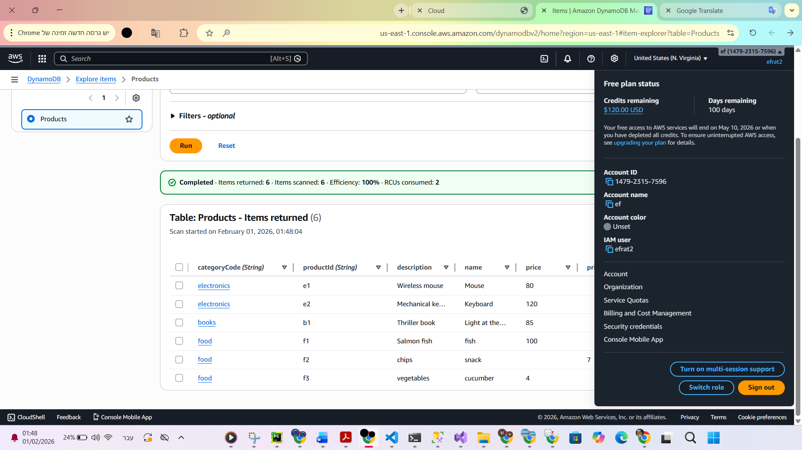

# AWS Serverless Products API

A full-stack application built with **Angular** for the frontend and **AWS Serverless Services** for the backend.

The backend is implemented using **AWS Lambda** and **Amazon DynamoDB**, exposing REST endpoints that retrieve product information based on category or product ID.

---

# Technologies

### Frontend
- Angular
- TypeScript
- HTML
- CSS

### Backend
- AWS Lambda
- Amazon DynamoDB
- AWS SDK v3
- Node.js (JavaScript)
- REST API
- CORS

---

# Architecture

```text
                Angular Client
                      │
                 HTTP Requests
                      │
              AWS Lambda Functions
               ┌───────────────┐
               │               │
      Get Products      Get Product
      By Category       By Category & ID
               │               │
               └───────┬───────┘
                       │
               Amazon DynamoDB
                    Products
```

---

# Project Overview

This project demonstrates how to build a serverless backend on AWS and connect it to an Angular frontend.

The application stores product information inside a DynamoDB table and exposes Lambda functions that retrieve:

- All products from a specific category
- A single product using its category and product ID

The project demonstrates working with AWS managed services without provisioning servers.

---

# DynamoDB Table

**Table Name**

```
Products
```

**Primary Key**

| Key | Type |
|------|------|
| categoryCode | Partition Key |
| productId | Sort Key |

Example data:

| categoryCode | productId | name |
|--------------|-----------|------|
| electronics | e1 | Mouse |
| electronics | e2 | Keyboard |
| books | b1 | Book |
| food | f1 | Fish |

---

# AWS Lambda Functions

## Get Products By Category

Returns all products that belong to a specific category.

Example request:

```http
GET /products?categoryCode=electronics
```

Features:

- Reads `categoryCode` from query parameters
- Uses DynamoDB `QueryCommand`
- Returns a list of matching products
- Input validation
- CORS support

---

## Get Product By Category And ID

Returns a single product using the composite primary key.

Example request:

```http
GET /product?categoryCode=electronics&productId=e1
```

Features:

- Reads `categoryCode` and `productId`
- Uses DynamoDB `GetCommand`
- Returns a single product
- Returns HTTP 404 if the product does not exist
- Input validation
- CORS support

---

# Project Structure

```text
.
├── src/
├── screenshots/
├── package.json
├── angular.json
├── README.md
└── ...
```

---

# Screenshots

### AWS Lambda – Get Products by Category (Part 1)

Initialization of the Lambda function, request validation, and preparation for querying the DynamoDB table.

.png)

---

### AWS Lambda – Get Products by Category (Part 2)

Execution of the DynamoDB query, processing the response, and handling successful and error responses.

.png)

---

### AWS Lambda – Get Product by Category and ID (Part 1)

Initialization of the Lambda function, reading request parameters, and validating the input.

.png)

---

### AWS Lambda – Get Product by Category and ID (Part 2)

Retrieving a single product from DynamoDB, returning the response, and handling errors.

.png)

---

### Amazon DynamoDB – Products Table

The DynamoDB table used by the Lambda functions. The table uses `categoryCode` as the partition key and `productId` as the sort key.



---

## Amazon DynamoDB – Products Table

Products table used by the Lambda functions.

- Partition Key: `categoryCode`
- Sort Key: `productId`


---

# Features

- Angular frontend
- Serverless AWS backend
- AWS Lambda functions
- Amazon DynamoDB integration
- REST API
- Query and Get operations
- Composite primary key
- JSON responses
- Input validation
- CORS support

---

# Learning Outcomes

During this project I practiced:

- Building serverless applications with AWS
- Creating AWS Lambda functions
- Working with Amazon DynamoDB
- Using AWS SDK v3
- Designing REST APIs
- Querying DynamoDB using a partition key
- Retrieving items using a composite primary key
- Connecting an Angular frontend with AWS backend services
